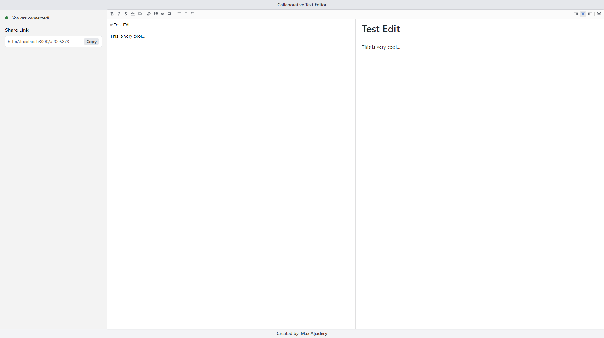

# Collaborative Text Editor

Collaborative Text Editor is an open-source text editor that allows you to collaborate with others. It allows users to identify written markdown in real-time. No DB is required to run this. 



The server is written in NodeJS (Express) and the frontend is NextJS.


## Setup 

### Frontend
```
npm install && npm run build && npm run start
```

### Backend
```
npm install && npm run build && npm run start
```

## License

All code is under MIT license. 